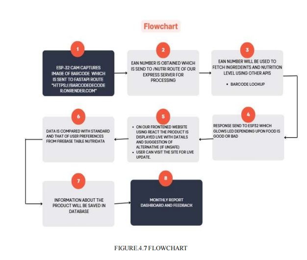
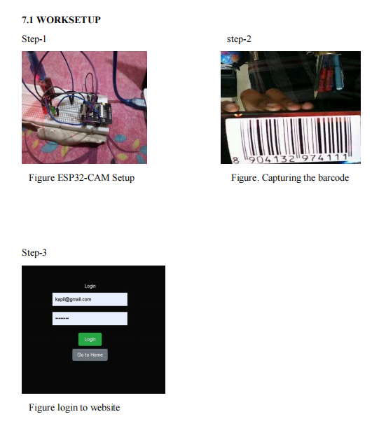
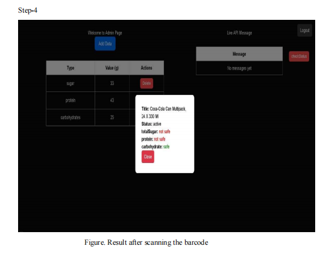

## 🔍 Project Overview

NutriScan is a simulation of our vision for a smart **nutrition-aware wearable band** that instantly identifies whether a food item suits the user's dietary needs. Most people don’t know their allergen risks or nutritional requirements — NutriScan bridges this gap. Instead of building just another app, we chose to design a **dedicated IoT device** for faster, hands-free decisions. This functionality can also be added to existing health bands as a powerful feature upgrade.


## 🧰 Tech Stack

### 📦 Hardware Components
- **ESP32-CAM** – for barcode image capture and Wi-Fi transmission
- **FTDI Programmer** – to flash and debug ESP32-CAM
- **LED Indicators (Green/Red)** – for real-time visual feedback
- **Li-ion Battery / USB Power Supply** – for mobile, wearable operation


---

### 💻 Software Components

#### 🔹 Firmware & Programming
-**Existing code for camerawebserver from esp32 examples(in arduino IDE) is used to simplify additional work and stick to actual idea.Some tweaks are introduced which are mentioned later on this repo**
- **Arduino IDE** – ESP32-CAM code development and upload
- **C/C++** – Camera initialization, image capture, and HTTP handling

#### 🔹 Backend
- **FastAPI** – for image decoding and barcode reading
- **Express.js (Node.js)** – for ingredient analysis, Firebase integration, and API routing
- **Firebase Realtime Database** – for storing scan history
- **Firebase Authentication** – for user identification via Wi-Fi password

#### 🔹 Frontend
- **React.js** – for displaying live scan results, login/signup, and dashboard
- **Next.js** – used for routing and admin panel rendering

#### 🔹 Deployment & Hosting
- **Render** – to host backend APIs
-**Vercel**-to host frontend
- **ESP32 HTTPClient** – to interact with hosted services (with SSL handling)

## 🌐 External Tools & APIs Used

- **BarcodeLookup API** – Used to fetch detailed product and ingredient information from the EAN barcode.(limited request support in free tier)
- **Dynamsoft Barcode Reader** – Python-based library used on the server side to decode barcodes from images with high accuracy.(require liscense and allow 1 month usage in free tier)
---

## 👨‍💻 Contributors

This mini project was developed as part of the B.Tech coursework in the Department of Electronics & Communication Engineering, MANIT Bhopal.

### 👥 Team Members

- **Fardeen Khan**  
- **Asish Singh** 
- **Vivek Mimrot** 
- **Kapil Dawar**  

### 🎓 Guided By

- **Dr. Arvind Rajawat** – Project Supervisor  


## 📸 ESP32-CAM Camera Server Setup (Image Capture & Response System)

This repository contains all necessary files to set up the ESP32-CAM as a web server that captures images of barcodes, sends them to a backend server for decoding, and receives nutritional suitability status in response and handles LED feedback based on the server’s decision.

### 🧩 Hardware Details

- **📷 CAMERA MODEL:** RHYX M21-45  
- **📷 CAMERA SENSOR:** GC2145  
  > ⚠️ *Important: This is NOT the commonly used OV2640 sensor. Special handling and tuning were done for compatibility with GC2145.*

- **🔌 MTDI Programmer (FTDI - FT232RL)** – Used to flash code onto the ESP32-CAM and for serial communication.
- **🔋 Power Supply:** 3.7V Li-ion Battery / USB (regulated)
- **🔴🟢 LEDs:** Connected to GPIO pins to indicate whether the scanned product is safe (Green) or unsafe (Red)

---

## 🧠 What's Important in This Repo?

The base code in this repository is derived from the official **`CameraWebServer`** example provided within the **ESP32 board support package** in the **Arduino IDE**. This example forms the foundation for camera initialization, image capture, and web server hosting.

However, several important **custom modifications** have been made:

- ✅ **`CameraWebServer.ino`**: Customized to handle image capture and communication with the backend server.
- ✅ **`app_httpd.cpp`**: Edited to send JPEG image data in chunks and manage HTTP responses more efficiently.
- ✅ All custom logic is clearly marked between special comment blocks:
// ============================
// 🔧 Modified or Custom Logic
// ============================
---

## 🐞 Issues & Solutions

During development with the RHYX M21-45 ESP32-CAM module (GC2145 sensor), several hardware and software-specific challenges were encountered and resolved:

1. **✅ RGB565 Format Support**  
   The RHYX board with GC2145 sensor supports **only `PIXFORMAT_RGB565`** — using other formats like JPEG directly can cause errors or blank frames.

2. **✅ GC2145 Sensor – Not OV2640**  
   Unlike common ESP32-CAMs, this module uses the **GC2145 sensor**, which requires different tuning for brightness, contrast, and flip settings. Initialization code must reflect this.

3. **✅ JPEG Conversion Required**  
   Captured images in RGB565 format **must be converted to JPEG** using `frame2jpg()` before being sent over HTTP to the backend server. This step is essential for network transmission.

4. **✅ Image Enhancements via `else` Block**  
   To control brightness, contrast, and sharpness for GC2145, you must add an **`else` block** in `camserver.ino` to handle non-OV sensors separately:
   ```cpp
   else {
     s->set_brightness(s, 1);
     s->set_contrast(s, 2);
     ...
   }

## Project Pics


## 

## 



## 🔭 Future Improvements

- **AI-based Ingredient Classification** – Use machine learning to better detect harmful or disguised ingredients from raw text or labels.
- **Alternative Product Suggestion** – Enhance backend logic to recommend safer and similar products when a scanned item is unsuitable.
- **Standalone Robust Device** – Optimize the ESP32-based hardware into a fully self-contained wearable without reliance on external devices.
- **Mobile App for Users** – Build an Android/iOS app for users to track history, receive notifications, and manage their dietary profiles more easily.


## ✅ Final Note

NutriScan is a step toward smarter and more personalized nutrition awareness. With continued development, it aims to evolve into a fully independent health companion for everyday use.
